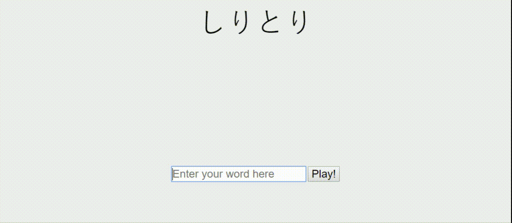

[Shiritori](https://chuynh18.github.io/shiritori/)
=========

A [Japanese rhyming game](https://en.wikipedia.org/wiki/Shiritori).  This is just a proof-of-concept and is missing a lot of required features.

**Project in collaboration with [cliffpham](https://github.com/cliffpham).**

Features
--------
* A very limited Japanese dictionary.  If the game recognizes the word you've used, it will show the meaning of that word in English.
* Matching logic properly matches across both Hiragana and Katakana words.  (You can follow a Hiragana word with a Katakana word and vice versa.)
* Automatically romanizes Hiragana and Katakana.  Handles [Sokuon](https://en.wikipedia.org/wiki/Sokuon) and (for Katakana) [Chōonpu](https://en.wikipedia.org/wiki/Ch%C5%8Donpu).
* Highlights the phonemes that must match (last phoneme of leading word, first phoneme of following word).
    * Highlighting properly handles [digraphs](https://en.wikipedia.org/wiki/Y%C5%8Don).
* Simple transition animations to help make the flow and rules of the game more obvious.
* The page should display just fine on mobile devices.

Limitations
-----------

As mentioned, this is simply a proof-of-concept.  Known limitations are:
* Does not actually know what words are actual Japanese words, as I don't have access to a good Japanese dictionary file
    * So it won't limit you to just nouns (but of course...  it can't distinguish between real words and gibberish)
* Text entry box is not restricted to only Japanese characters
  
This is merely a proof-of-concept (turning this into a real product would require access to a comprehensive Japanese dictionary file), and there may be bugs.  That being said, the core logic exists!