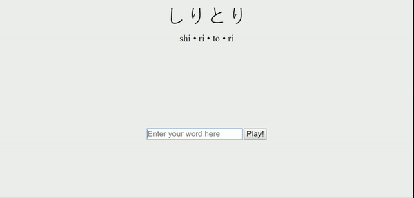

[Shiritori](https://chuynh18.github.io/shiritori/)
=========

A [Japanese rhyming game](https://en.wikipedia.org/wiki/Shiritori).  This is just a proof-of-concept and is missing a lot of required features.

**Project in collaboration with [cliffpham](https://github.com/cliffpham).**

Limitations
-----------

As mentioned, this is simply a proof-of-concept.  Known limitations are:
* Does not actually know what words are actual Japanese words
    * So it won't limit you to just nouns (but of course...  it can't distinguish between real words and gibberish)
* Text entry box is not restricted to only Japanese characters
* No katakana support
* First pass at mobile responsiveness is in, but I'm not sure how it actually looks across all mobile devices.

Of course, there may be bugs!